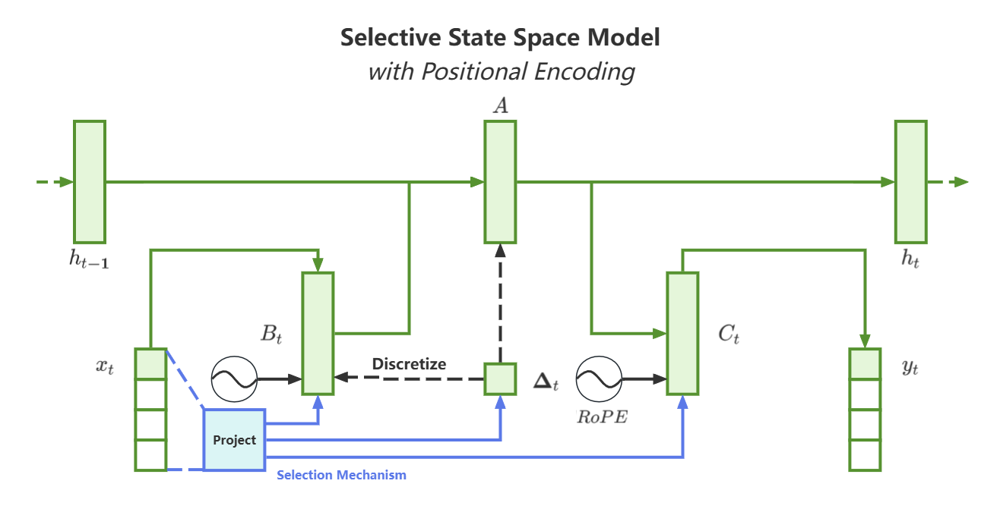
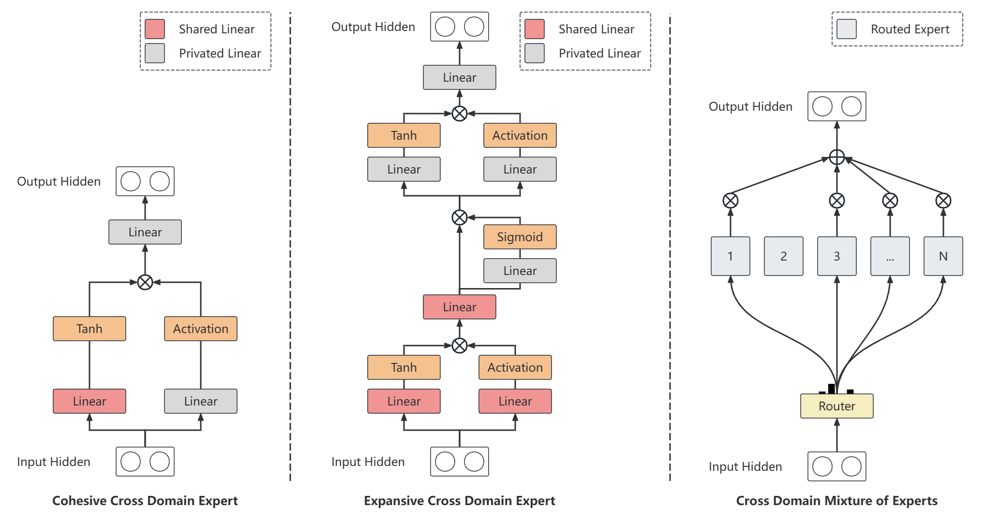

# OTCE

Read this in [Chinese](README_zh.md)






> **OTCE: Hybrid SSM and Attention with Cross Domain Mixture of Experts to construct Observer-Thinker-Conceiver-Expresser**\
> Jingze Shi et al.*\
> Paper: https://arxiv.org/abs/2406.16495


## About

OTCE is a hybrid of SSM and Attention algorithms, with a sparse model architecture with cross-domain shared parameters, which outperforms models driven solely by SSM or Attention in language modeling.

As a poor student, most of the computing power and a small amount of data for this project come from the resources of the cross project of medicine and software engineering in our university.  The checkpoint weights are not allowed to be open-sourced, only the modeling code written by me can be open-sourced.


## Requirements

- Linux
- NVIDIA GPU
- CUDA 11.6+
- PyTorch 1.12+
- `pip install transformers==4.41.2 causal-conv1d>=1.2.0 mamba-ssm sentencepiece`

## Usage

Same as using tokenizers, configurations, and models in the Transformers library.

## Example

```python
from OTCE.tokenization_cheems_OTCE import CheemsOTCETokenizer
from OTCE.configuration_cheems_OTCE import CheemsOTCEConfig
from OTCE.modeling_cheems_OTCE import CheemsOTCEForCausalLM

# Initialize
tokenizer = CheemsOTCETokenizer("cheems_tokenizer.model")
config = CheemsOTCEConfig()
model = CheemsOTCEForCausalLM(config=config)

# Or load from the path of the saved checkpoint
config = CheemsOTCEConfig.from_pretrained("<path_to_saved_checkpoint>")
model = CheemsOTCEForCausalLM.from_pretrained("<path_to_saved_checkpoint>", config=config)

input_ids = tokenizer("I am Cheems!", return_tensors='pt').to(model.device)["input_ids"]

outputs = model.generate(input_ids, max_new_tokens=32)

print(tokenizer.batch_decode(outputs))
```

```shell
['[gMASK]sop I am Cheems! Thank you Cheems!']
```

## Citation

If you find this project helpful in your work, please cite OTCE:

```bibtex
@article{shi2024otce,
  title={OTCE: Hybrid SSM and Attention with Cross Domain Mixture of Experts to construct Observer-Thinker-Conceiver-Expresser},
  author={Shi, Jingze and Xie, Ting and Wu, Bingheng and Zheng, Chunjun and Wang, Kai},
  journal={arXiv preprint arXiv:2406.16495},
  year={2024}
}
```
