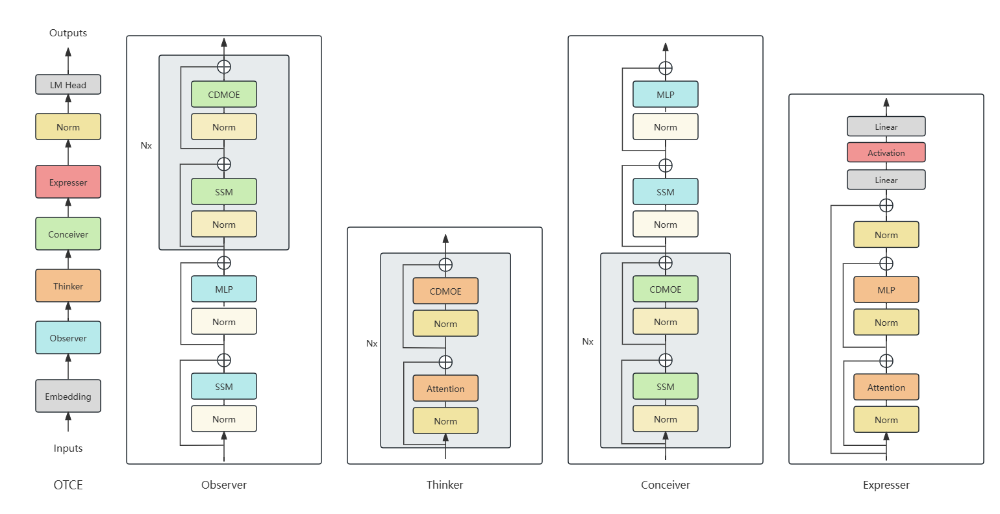
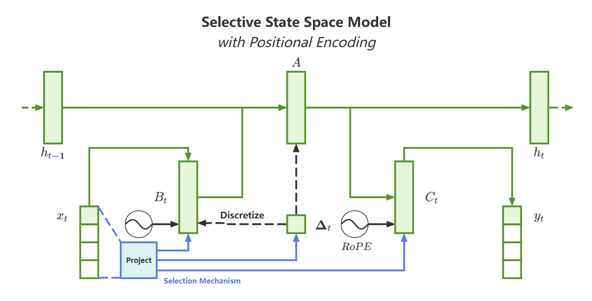
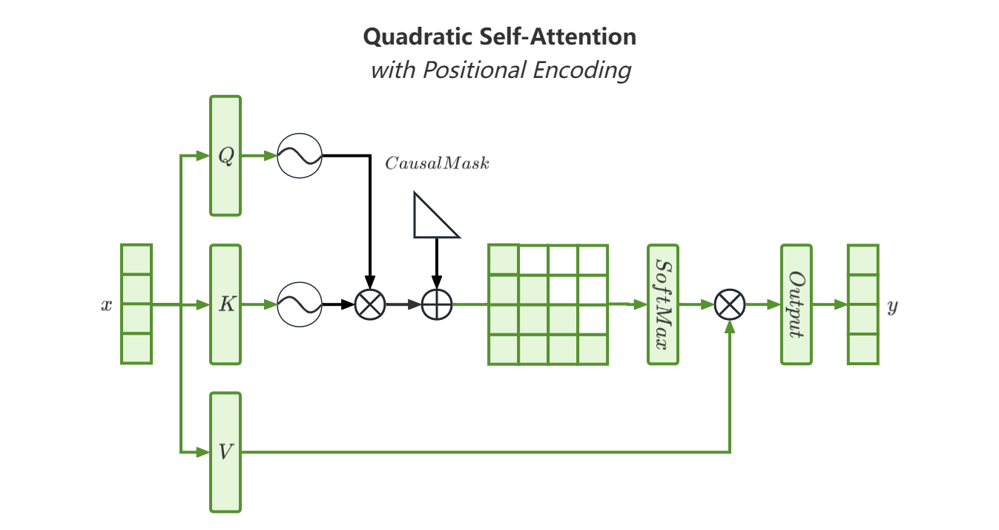
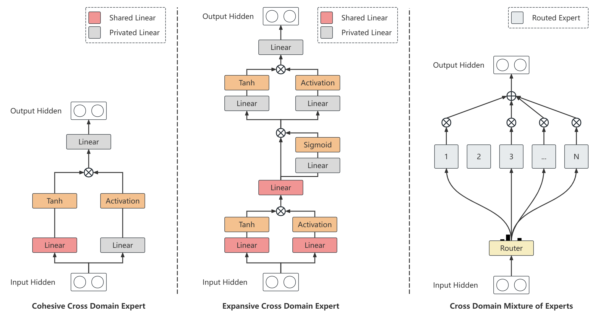

# OTCE

Read this in [English](README.md)






> **OTCE: Hybrid SSM and Attention with Cross Domain Mixture of Experts to construct Observer-Thinker-Conceiver-Expresser**\
> Jingze Shi et al.*\
> Paper: https://arxiv.org/abs/2406.16495


## 关于

OTCE 是一种融合了 SSM 和 Attention 算法, 具有交叉领域共享参数的稀疏模型架构, 在语言建模中表现出了超越单独由 SSM 或 Attention 驱动的模型的性能.

由于我是一个穷学生, 本项目的大部分算力与少部分数据来源于我校的医工交叉项目资源, 检查点权重不允许开源, 只能开源由我编写的建模代码.


## 需求

- Linux
- NVIDIA GPU
- CUDA 11.6+
- PyTorch 1.12+
- `pip install transformers causal-conv1d>=1.2.0 mamba-ssm sentencepiece`

## 使用

与使用 Transformers 库中分词器, 配置, 模型的方法相同.

## 示例

```python
from OTCE.tokenization_cheems_OTCE import CheemsOTCETokenizer
from OTCE.configuration_cheems_OTCE import CheemsOTCEConfig
from OTCE.modeling_cheems_OTCE import CheemsOTCEForCausalLM

tokenizer = CheemsOTCETokenizer("cheems_tokenizer.model")

# 初始化
config = CheemsOTCEConfig()
model = CheemsOTCEForCausalLM(config=config)

# 或者从保存检查点的路径加载
config = CheemsOTCEConfig.from_pretrained("<保存检查点的路径>")
model = CheemsOTCEForCausalLM.from_pretrained("<保存检查点的路径>", config=config)


input_ids = tokenizer("I am Cheems!", return_tensors='pt').to(model.device)["input_ids"]

outputs = model.generate(input_ids, max_new_tokens=32)

print(tokenizer.batch_decode(outputs))
```

```shell
['[gMASK]sop I am Cheems! Thank you Cheems!']
```

## 引用

如果您觉得这个项目对您的工作有所帮助, 请引用 OTCE:

```bibtex
@article{shi2024otce,
  title={OTCE: Hybrid SSM and Attention with Cross Domain Mixture of Experts to construct Observer-Thinker-Conceiver-Expresser},
  author={Shi, Jingze and Xie, Ting and Wu, Bingheng and Zheng, Chunjun and Wang, Kai},
  journal={arXiv preprint arXiv:2406.16495},
  year={2024}
}
```