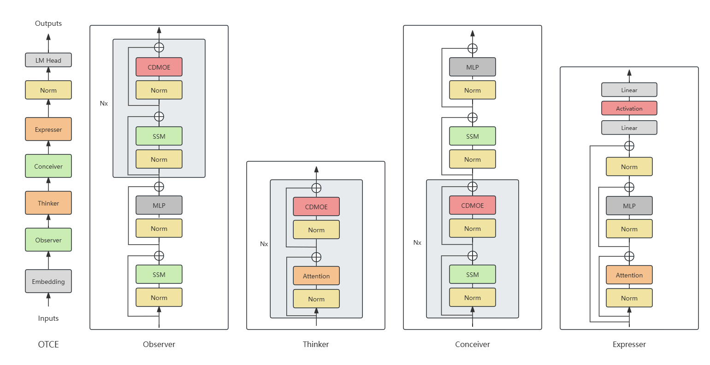

# OTCE

Read this in [English](README.md)

> **OTCE: Hybrid SSM and Attention with Cross Domain Mixture of Experts to construct Observer-Thinker-Conceiver-Expresser**\
> Jingze Shi*\
> Paper: 

## About

OTCE 是一种融合了 SSM 和 Attention 算法, 具有交叉领域共享参数的稀疏模型架构, 在语言建模中表现出了超越单独由 SSM 或 Attention 驱动的模型的性能.

由于我是一个穷学生, 本项目的大部分算力与少部分数据来源于我校的医工交叉项目资源, 检查点权重不允许开源, 只能开源由我编写的建模代码.

## Requirements

- Linux
- NVIDIA GPU
- CUDA 11.6+
- PyTorch 1.12+
- `pip install transformers causal-conv1d>=1.2.0 mamba-ssm sentencepiece`

## Usage

与使用 Transformers 库中的分词器, 配置, 模型方法相同.